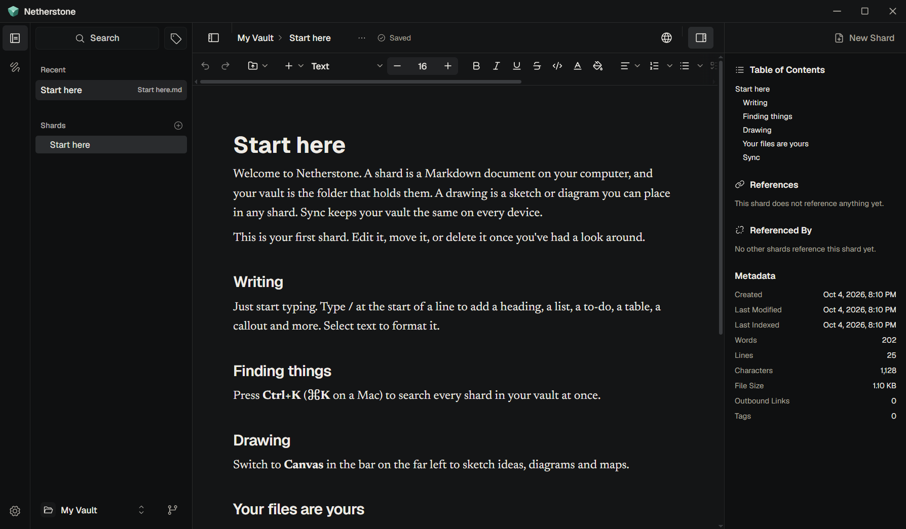

<div align="center">

<picture>
  <source media="(prefers-color-scheme: dark)" srcset="docs/lockup-dark.svg" />
  
</picture>

_Your knowledge, set in stone._

</div>



Netherstone is a desktop app for your knowledge: notes, documents, drawings
and more. Every shard is a document saved as a plain Markdown file in a
folder you choose, so your work stays yours, readable by any app, and fully
available offline.

## Download

Get the latest version for Windows, macOS or Linux from
[Releases](https://github.com/Netherstone-HQ/Netherstone/releases/latest).

## Features

- **Your files, your folder.** A vault is an ordinary folder of Markdown
  files. Open any folder and start writing.
- **A writing editor, not a code editor.** Rich formatting as you type, with
  no Markdown syntax in the way.
- **Instant search.** Find any word across thousands of shards.
- **Connected knowledge.** Type `@` to link to another shard, organise with
  `#tags`, and see each document's outline.
- **Drawings and attachments.** Sketch with Excalidraw, and drop in images,
  PDFs, audio and video.
- **Free sync you own.** Back up each vault to your own private GitHub
  account and keep it in sync across devices. No technical setup.
- **Nothing lost.** Saves are crash-safe, and when a shard changed on two
  devices you choose which version to keep.

## Building from source

You need [Node.js](https://nodejs.org/) 18+, [pnpm](https://pnpm.io/),
[Rust](https://www.rust-lang.org/tools/install) and the
[Tauri prerequisites](https://v2.tauri.app/start/prerequisites/) for your OS.

```sh
pnpm install
pnpm tauri dev     # run the app
pnpm test          # run the tests
pnpm tauri build   # build an installer
```

## Learn more

[Architecture](docs/ARCHITECTURE.md) ·
[Attachments](docs/ATTACHMENTS_ARCHITECTURE.md) ·
[Git sync](docs/GIT_SYNC_ARCHITECTURE.md)

## License

[GNU GPL-3.0](LICENSE)
